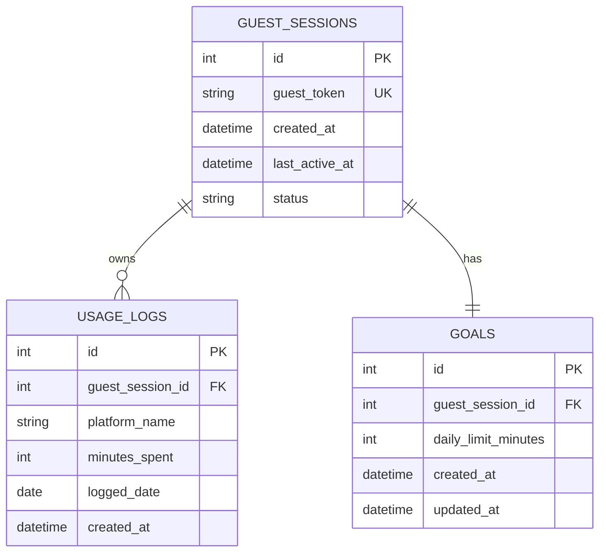

1. Problem Statement
What problem are you solving, and for whom? One short paragraph.

The project we are building is a personal doomscroll tracker (mobile only) that logs daily social media usage. It solves the problem of not realizing how much time doomscrolling takes up of your day. The tracker will aim to make doomscrolling time across various apps (Instagram, Tiktok, Youtube, etc.) visible with various ways of displaying data, like graphs showing usage over time, a pie chart to show percentage of day spent on each app and doomscrolling in total, etc. This project targets anyone with the goal to understand how much time doomscrolling takes up in their day.

2. Proposed Solution
A high-level description of what you're building. Include a rough sketch or description of the UI.

We are building a personal doomscroll tracker (mobile only) that logs daily social media usage through user manual entry. On first launch, user will be prompted with an onboarding to manually select social media apps that the user wants to be tracked. Then the user is sent to the main dashboard. 

Main dashboard UI (top to bottom):
- My Goal (optional): User can set a goal for themselves for doomscrolling time, then this section updates to be "You are over/under/at your doomscrolling goal today", and graphs below will update with a visual indicator as well
- Log session: The user's main daily interaction is to log their sessions in minutes for each app. The apps will be pre organized in rows with a icon and app name on the left, then on the right the user inputs their minutes used today.
- Insights section: The area where all graphs, statistics are displayed

General UI: 
- Rounded feel where sections are framed as rounded cards

3. User Flows
Walk through the main ways a user interacts with your app. Numbered steps, not prose. 

On download/first use:
1. User opens the app and is prompted with an welcome onboarding
2. User is given a screen with buttons for each social media platform, user chooses which to track

Beyond first use, main daily use:
1. User opens the app and will see a dashboard with weekly stats (graphs)
2. User clicks on "Log session for __" button and enters time spent for the __ platform 
3. If needed, user can add another platform with a + icon
4. If needed, user can press a help button that has tabs on how to find screen time for each app (options through iOS, andriod, in-app settings)
5. The dashboard updates with today's screen time and weekly stats, where graphs are customizable in time frame (1 week, 1 month, 3 months, 6 months, 1 year)

Optionals after main daily use:
1. User can click on a "My Goal" button in the main dashboard, app now prompts user to enter a time, and graphs update with a visual indicator if the user met their goal, new section in dashboard that will say "You are over/under/at your doomscrolling goal today"

4. Architecture
Describe how the system is structured:

Frontend: What does the UI look like? What pages or views are there?
- One home dashboard screen with minimal UI, rounded feel, swipe down for sections for goals, logging a session, statistics 

Backend API: What does your server do? List your API endpoints — the HTTP method, the path, what it accepts, and what it returns. Your backend should expose a proper API (e.g. a REST API) that your frontend calls. It should not serve HTML directly or mix frontend and backend logic.
- We will use a REST API where our backend will be a guest-session API, not account based since we don't need users to create accounts
- The backend server will store doomscrolling data and will be accessed through a guest token/ID to validate users

API endpoints:
Method:         Path:                 Accepts:                                                 Returns:
POST            /api/guest-sessions	  Created for first-time users, doesn't need data          A guest session ID or token used for future requests 
POST	        /api/logs	          Guest token + log data (app name, minutes used, time)    The created log entry with its ID and saved values 
GET	            /api/logs	          Guest token, optionally date filters                     A list of log entries for that guest session 
GET	            /api/summary	      Guest token, optionally a date range                     Stats such as total minutes or most-used apps 
PATCH	        /api/logs/:id	      Guest token + updated log fields (ID is in URL)          The updated log entry 
DELETE	        /api/logs/:id	      Guest token (ID is in URL)                               Success message or 204 No Content 
    
Database: What data are you storing? Include a schema (table names, columns, types, relationships).
This section must include at least one Mermaid diagram. Use whichever diagram type best fits your system — an entity-relationship diagram for your schema, a sequence diagram for a key user flow, or a component/architecture diagram. GitHub renders Mermaid natively in markdown. 

Schema:

guest_sessions
Stores the anonymous guest identity issued by the backend.
- id — INTEGER, primary key
- guest_token — TEXT, unique, backend-issued identifier or token
- created_at — DATETIME
- last_active_at — DATETIME
- status — TEXT, such as active or expired

usage_logs
Stores individual doomscrolling records.
- id — INTEGER, primary key
- guest_session_id — INTEGER, foreign key to guest_sessions.id
- platform_name — TEXT
- minutes_spent — INTEGER, constrained to 0–1440
- logged_date — DATE
- created_at — DATETIME

goals
Stores a user’s daily screen-time target.
- id — INTEGER, primary key
- guest_session_id — INTEGER, foreign key to guest_sessions.id
- daily_limit_minutes — INTEGER, constrained to 0–1440
- created_at — DATETIME
- updated_at — DATETIME

A guest session can own multiple logs, each log belongs to one guest session
A guest session can set one goal, each goal belongs to one guest session

5. Tech Stack
List the technologies you're using and justify each choice in one or two sentences. "Everyone uses it" is not a justification. "It's a lightweight Node framework that handles routing with minimal boilerplate, which fits our simple API needs" is.

- React Native: Framework for building mobile apps with JavaScript/Typescript, has a simplicity advantage over Swift for iOS and Kotlin for Android, no need to use two seperate frameworks for two seperate operating systems
- Expo: Set of tools and services built on top of React Native to simplify development and speed up production
- Expo Router: Part of Expo, file-based router to manage navigation between app screens, less navigation setup compared to React Navigation
- TypeScript: Javascript but strongly typed, better than Javascript to limit programming errors
- SQLite: Lightweight and simple database, don't need complex features like cloud sync and accounts, just storing logs of doomscrolling time, noSQL isn't needed since our data isn't very dynamic, logs between days will look simliar to other days
- Node.js with Express: Simple way to build a REST API, lightweight and beginner friendly, will be our backend server to recieve requests from frontend and return JSON responses

6. Out of Scope
What are you explicitly not building? This is important — it keeps scope from creeping. List features or use cases you considered but decided to skip for now.

Not building:
- User accounts, login, passwords - Authentication is not really needed for a screen time app, adds friction to onboarding
- Cloud sync - More complicated to implement, keeping it simple for now
- Getting screen times direct from OS - Our inital thought on data collection but is platform specific and not very beginner friendly to do
- Beyond the mobile platform - No support for desktop or browser, doomscrolling usually happens on our phone anyways and its unlikely you need to check stats on a computer or website

Possible ideas that are more reasonable to be implemented:
- User retention features: Ex. notifications to remind user that they haven't logged their doomscrolling time today or streaks of consecutive logs or consecutively being under the user's goal

7. Security Considerations
Think through how your app could be abused or how user data could be exposed. You don't need an exhaustive threat model, but you do need to show that you've thought about it. For each point, describe what you're doing about it — not just that you're aware. Things to consider:

Authentication & authorization: How do you verify who a user is? How do you ensure a user can only access their own data?
- For the initial version we aren't building account login features or social components across users, but the app supports anonymous guest identities to make multiple users able to access their own data
- This is weaker than server controlled authentication with accounts, guest sessions are lost if user switches devices or deletes the app, can't be used across devices
- To help with that we will issue the guest ID through the backend server instead of client side, limit the guest ID permissions below admin level, securely storing the guest ID on the client side

Input validation: What happens if a user submits unexpected or malicious input? (Think: SQL injection, XSS.)
- For logs and goals, the backend will only accept integers from 0-1440 (none to a full day), reject everything else
- For logs if the user wants to add a platform we haven't included in the "other" field we would limit the input to be a string about about 1-20 characters, trim whitespace, limit accepted punctuation to an allowlist
- Use parameterized queries (queries with placeholders for input) to prevent SQL injection
- User input will never be rendered as raw HTML in any web-based interface, reducing XSS risk

Sensitive data: Are you storing passwords? If so, are you hashing them? Are there any API keys or secrets that should never be in the codebase?
- Main thing to protect is the guest ID, it should be treated as sensitive data as it is what the server uses to access user information
- They will be generated by the backend, stored securely on the device, and will be validated server-side rather than trusted as arbitrary client input

Exposed endpoints: Are any of your API endpoints accessible without authentication that shouldn't be?
- Only the POST api/guest-sessions will be public for users to create a guest session, will have rate limiting on this 
- The rest of the methods will be private and need a guest ID

8. Repository Setup
Document how your GitHub repository is configured:
Setting this up is part of the exercise. A repo without branch protection on main will be flagged in review.

Branch protection: Describe what branch protection rules you've set on main (e.g., requiring PRs before merging, requiring at least one approval). Justify why these rules are useful — don't just list them.
- Require PRs before merging + one approval: Prevents the main branch from being changed directly and prevents code errors as one teammate has to read the PR before accepting the PR to main
- Dismiss stale approvals when new commits are pushed: Prevents new code from not actually being reviewed as the old PR acceptance is used for the new commits
- Block force pushes: Prevents one person from directly overwriting history and code without PR review

Who has access: Both teammates should be collaborators.
- Both teammates are added are collaborators (1 owner 1 collaborator)

9. Open Questions
List anything you're unsure about or haven't figured out yet. These are things to resolve before or during implementation.
- Require status checks to pass: Unsure about lint and typechecking implementation and adding checks in github

10. A Note
This is, for many of you, the first time a senior member of the club is seeing your quality of work. Try to ensure that it is of a high standard, and that you genuinely understand your approach. LLMs can build design docs like this, but often struggle in industry / at scale to build really good design doc - this is one of the few places where humans are still really needed. Practice your problem solving skills and try to write, or at least ideate, the majority of this design doc yourself.